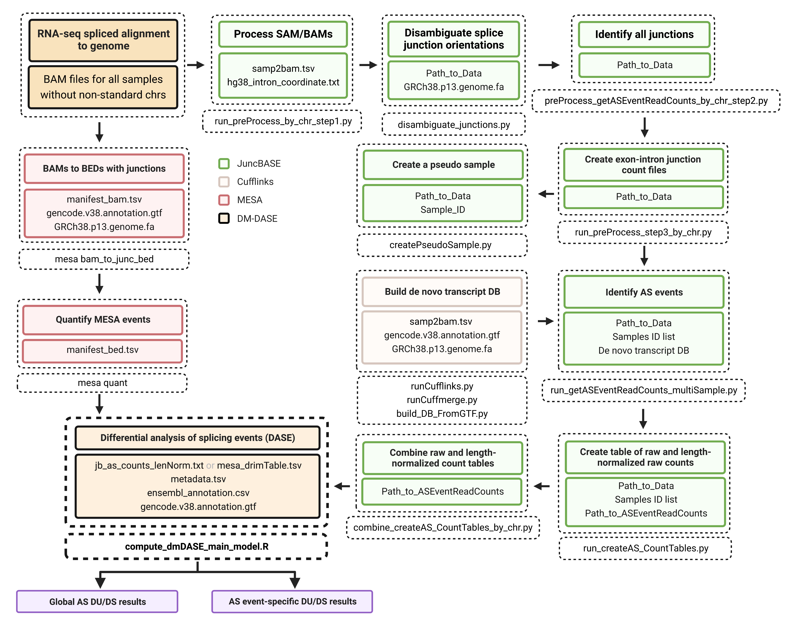
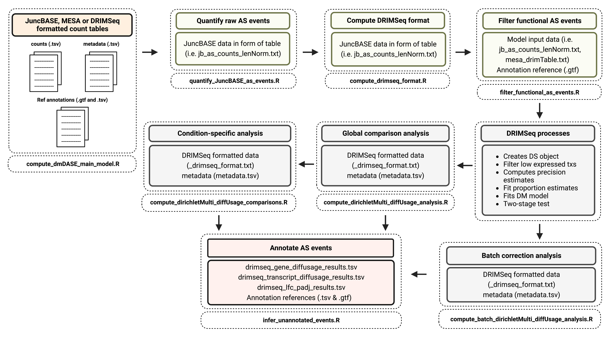
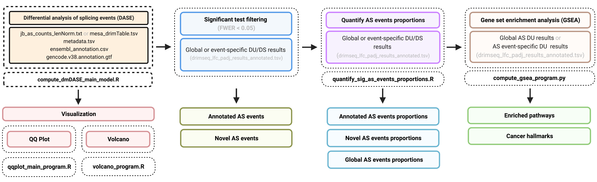

# DM-&Delta;ASE

Diritchlet-multinomial differential analysis of splicing events (DM-DASE). The workflow includes pre-computing splicing events counts with <a href="https://github.com/anbrooks/juncBASE">JuncBASE</a> or percent-spliced in (PSI) values with <a href="https://github.com/BrooksLabUCSC/mesa">MESA</a> or both for comparison or benchmarking analyses. Program performs differential transcript and gene usage (DU) or differential splicing (DS) analysis at the event- and gene-level in either JuncBASE or MESA or DRIMSeq formatted data tables by computing both gene- and transcript-level DM distributions (where each transcript ratio is modeled separately) using <a href="https://github.com/gosianow/DRIMSeq">DRIMSeq</a>. Program also includes the options to perform batch correction DU or DS and transcript usage QTL (tuQTL) analysis.

## End-to-end workflow

</h1>

You can find documentation <a href="docs/end_to_end_workflow.md">here</a>

## DM-DASE Model

#### Pre-processing steps

* Formats input data to DRIMSeq format 
* Filters funtional AS events by mapping them to reference. Events are considered functional if there is a transcript annotation associated with the event region, this allows to select for specific genomic features (optional) and reduces the computational cost of downstream analyses.
* Quantifies proportions for global, known and novel AS events (JuncBASE only).

#### Main analysis

* Performs either DU or DS global and/or specific comparison analyses
* Performs gene and transcript level p-value adjustment using a two-stage test from stageR
* Calculates &Delta;PSI and LFC values from fitted transcript proportions from all MT vs WT conditions (for global analysis)
* If performing comparison analysis, model calculates &Delta;PSI and LFC values from fitted transcript proportions from samples in condition1 vs samples in condition2 
* Performs batch correction DU or DS analysis (optional)
* Annotates AS events with differential usage or splicing (both JuncBASE and/or MESA)

#### Optional

* Quantifies significant AS event proportions from DU or DS results (JuncBASE only)
* Perform enrichment/pathway analysis on significant AS events

</h1>

## Downstream analyses

</h1>

